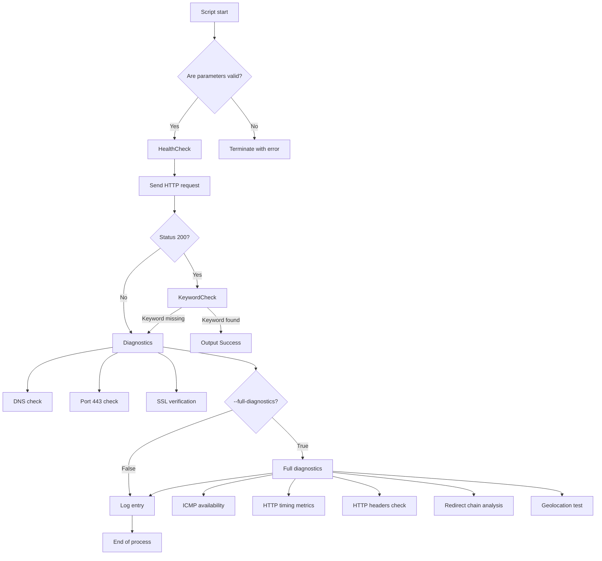

# Service Health and Diagnostic Monitor

## Overview
A command-line tool for checking the availability of web services with automatic problem diagnostics.

**Main features:**
- HTTP status check (200)
- Search for the keyword "Success" in the response body
- Automatic diagnostics on failures
- Detailed logging of all operations

## Key Features

✅ Service health check with configurable timeout  
✅ Comprehensive network problem diagnostics  
✅ Centralized logging in a standardized format  
✅ Support for essential CLI parameters  
✅ Multi-level diagnostics (basic/extended)  
✅ Full HTTP request cycle analysis with timing  

## Diagnostic Requirements
### Conditions to run diagnostics:
1. Run diagnostics if status != 200 or response body does not contain "Success"
2. Extended checks are activated with the flag `--full-diagnostics true`

### Diagnostic checks:
**Basic (always performed):**
1. **DNS Resolution (nslookup)**  
   Verify DNS records correctness
2. **Port Check (443/TCP)**  
   Validate HTTPS port accessibility
3. **SSL Certificate Verification**  
   Check certificate expiration and validity
4. **Latency Measurement**  
   Measure service response time

**Extended (require `--full-diagnostics`):**  

5. **Get Local and Public IP addresses**  
   Output local IP addresses
6. **ICMP Availability**  
   Check node availability via ping
7. **HTTP Timing Metrics**  
   Analyze DNS, connect, TTFB, and data transfer timings
8. **HTTP Headers Validation**  
   Check security headers and cache-control headers
9. **Redirect Chain Analysis**  
   Monitor redirect chains (max 3 redirects)

## Diagnostic Actions Explanation
| Check                     | Purpose                                                        | Mode        |
|---------------------------|----------------------------------------------------------------|-------------|
| DNS Resolution            | Detect DNS server issues or incorrect records                | Basic       |
| Port Check                | Verify availability of critical service ports                   | Basic       |
| SSL Verification          | Detect SSL certificate problems                                | Basic       |
| Keyword Check             | Confirm correct page content                                   | Basic       |
| ICMP Availability         | Check network reachability at layer 3                         | Extended    |
| HTTP Timing Metrics       | Localize delays at specific request stages                     | Extended    |
| HTTP Headers Check        | Validate security headers (HSTS, CSP)                          | Extended    |
| Redirect Chain Analysis   | Avoid false positives due to redirect chains                  | Extended    |
| Get your own IP address   | Show your local and public IPs used for internet access        | Extended    |

## Installation
```bash
git clone https://github.com/DeveloperDarkhan/servicehealth.git
cd servicehealth
python -m venv venv
source venv/bin/activate
pip install -r requirements.txt
```

## Usage
Basic run:
```bash
python health_check.py \
  --url https://sre-test-assignment.innervate.tech/health.html \
  --keyword "Success"
```

Available parameters:
| Parameter            | Default                         | Description                    |
|----------------------|---------------------------------|--------------------------------|
| --timeout            | 10                              | Request timeout (seconds)      |
| --log-file           | diagnostics.log                 | Log file                       |
| --keyword            | Success                         | Keyword to search in response  |
| --full-diagnostics   | false                           | Extended diagnostics mode      |

## Testing Scenarios
### Successful check
```bash
python health_check.py --url https://valid-url/health.html --keyword "Success"
```
**Expected result:**  
"Success" printed to stdout  
```plaintext
[2023-11-21 09:15:25] [INFO] [HTTP_CHECK] - Status code is 200 and response body contains a keyword "Success"
```

### Failed check
```bash
python health_check.py --url https://invalid-url/health.html --keyword "Success"
```
**Expected result:**  
- Empty stdout  
- Diagnostic logs written to `diagnostics.log`

### Extended diagnostics
```bash
python health_check.py --url https://problem-url/health.html --full-diagnostics true
```
**Expected result:**  
- All basic and extended checks in logs  
- Detailed performance metrics:
```plaintext
[2023-11-21 14:30:45] [INFO] [HTTP_TIMING] - DNS: 152ms, Connect: 320ms, TTFB: 410ms
[2023-11-21 14:30:47] [WARNING] [REDIRECTS] - 4 redirects detected (max allowed: 3)
```

## Logging Format
**Format requirements:**  
[YYYY-MM-DD HH:MM:SS] [LEVEL] [ACTION] - Message

When extended diagnostics are run, a message like this will be displayed:  
[YYYY-MM-DD HH:MM:SS] [INFO] [CONFIG] - Full diagnostics mode enabled

**Example logs:**
```plaintext
[2023-11-21 09:15:23] [ERROR] [HTTP_CHECK] - Status code 503 received
[2023-11-21 09:15:25] [INFO] [DNS_CHECK] - nslookup result for example.com: 192.0.2.1
[2023-11-21 09:15:27] [WARNING] [SSL_CHECK] - Certificate expires in 7 days
```

Full example logs: [Pastebin](https://pastebin.com/example123)

## Architecture




## License
MIT License. See the LICENSE file for details.
