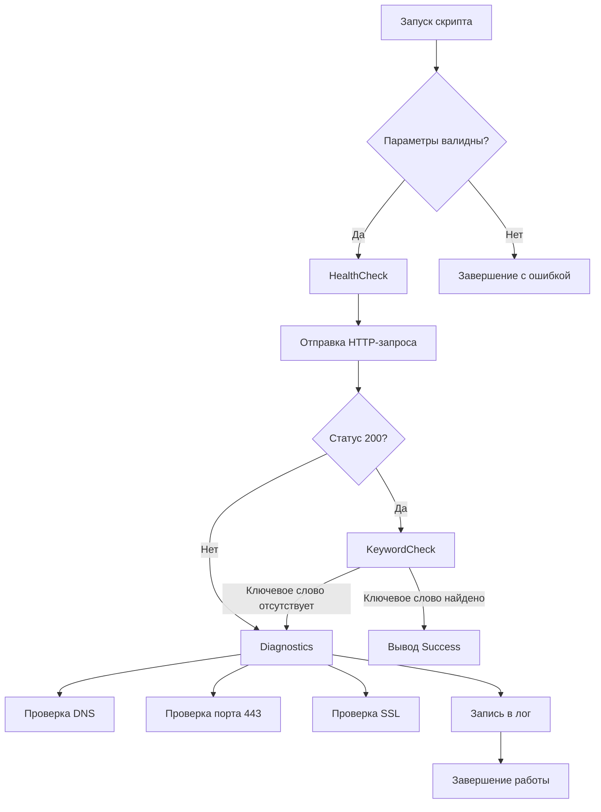

# Service Health and Diagnostic Monitor

## Overview
Командный инструмент для проверки доступности веб-сервисов с автоматической диагностикой проблем.

**Основная функциональность:**
- Проверка HTTP статуса 200
- Поиск ключевого слова "Success" в теле ответа
- Автоматический запуск диагностики при ошибках
- Детальное логирование всех операций

## Key Features
✅ Проверка здоровья сервиса с настраиваемым таймаутом  
✅ Комплексная диагностика сетевых проблем  
✅ Централизованное логирование в стандартизированном формате  
✅ Поддержка обязательных параметров CLI

## Diagnostic Requirements
### Условия запуска диагностики:
1. Запуск диагностики если статус не равен 200 или тело не имеет слова "Success"
2. Ниже приложена схема архитектуры исполнения программы 

### Диагностические проверки:
1. **DNS Resolution (nslookup)**  
   Проверка корректности DNS-записей
2. **Port Check (443/TCP)**  
   Валидация доступности HTTPS-порта
3. **SSL Certificate Verification**  
   Проверка срока действия и валидности сертификата
4. **Latency Measurement**  
   Замер времени отклика сервиса

## Diagnostic Actions Explanation
| Проверка         | Цель                                                                 |
|------------------|----------------------------------------------------------------------|
| DNS Resolution   | Выявление проблем с DNS-серверами или некорректных записей           |
| Port Check       | Проверка доступности критических портов сервиса                      |
| SSL Verification | Обнаружение проблем с SSL-сертификатами (истекшие, самоподписанные)  |
| Keyword Check    | Подтверждение корректности содержимого страницы                      |


## Installation
```
git clone https://github.com/your-repo/service-monitor.git
cd service-monitor
python -m venv venv
source venv/bin/activate
pip install -r requirements.txt
```

## Usage
Базовый запуск:
```
python health_check.py \
  --url https://sre-test-assignment.innervate.tech/health.html \
  --keyword "Success"
```

Доступные параметры:
| Параметр      | По умолчанию              | Описание                  |
|---------------|---------------------------|---------------------------|
| --interval    | 60                        | Интервал проверок (сек)   |
| --timeout     | 10                        | Таймаут запроса (сек)     |
| --log-file    | diagnostics.log           | Файл логов                |
| --retries     | 3                         | Число попыток             |
| --keyword     | Success                   | Поиск слова ответе        |


## Testing Scenarios
### Успешная проверка
```
python health_check.py --url https://valid-url/health.html --keyword "Success"
```

**Ожидаемый результат:**  
Вывод "Success" в стандартный вывод

### Неудачная проверка
python health_check.py --url https://invalid-url/health.html --keyword "Success"

**Ожидаемый результат:**
- Пустой stdout
- Запись диагностических данных в diagnostics.log

## Logging Format
**Требования к формату:**
[YYYY-MM-DD HH:MM:SS] [LEVEL] [ACTION] - Message

**Пример логов:**
```
[2023-11-21 09:15:23] [ERROR] [HTTP_CHECK] - Status code 503 received
[2023-11-21 09:15:25] [INFO] [DNS_CHECK] - nslookup result for example.com: 192.0.2.1
[2023-11-21 09:15:27] [WARNING] [SSL_CHECK] - Certificate expires in 7 days
```

Полный пример логов: [Pastebin](https://pastebin.com/example123)

## Architecture



## Advanced Features
- Экспорт метрик в формате Prometheus
- Контекстные таймауты для разных проверок
- Цветовой вывод в консоль
- Поддержка прокси-серверов
- Исторический анализ показателей

## 🚀 Roadmap

### Q4 2025 - Q1 2026
| Статус       | Задача                          | Приоритет |
|--------------|---------------------------------|-----------|
| ✅ Завершено | Базовый функционал мониторинга  | High      |
| ⏳ В работе  | Контейнеризация проекта         | Critical  |

### Планируемые улучшения

#### 🐳 Инфраструктура
- [ ] Docker-образ с многоэтапной сборкой
- [ ] Helm-чарт для Kubernetes-деплоя
- [ ] Поддержка запуска как systemd-сервиса

#### 📊 Телеметрия
- [ ] Экспорт метрик в Prometheus Format
- [ ] Интеграция OpenTelemetry SDK
- [ ] Трейсинг распределенных транзакций

#### 🔔 Уведомления
- [ ] Slack-webhook интеграция
- [ ] Поддержка PagerDuty/MS Teams
- [ ] Эскалация алертов по расписанию

#### 🛠️ Оптимизации
- [ ] Асинхронная модель выполнения
- [ ] Конфигурируемые политики алертинга
- [ ] Графический дашборд для визуализации (Grafana)

#### 🎯 Функциональные улучшения
- [ ] Параллельные проверки ресурсов
- [ ] YAML-конфиги для списков сервисов

## Contribution
1. Форкните репозиторий
2. Создайте ветку для фичи (`feature/your-feature`)
3. Добавьте тесты
4. Отправьте Pull Request

## License
MIT License. Подробнее см. в файле LICENSE.