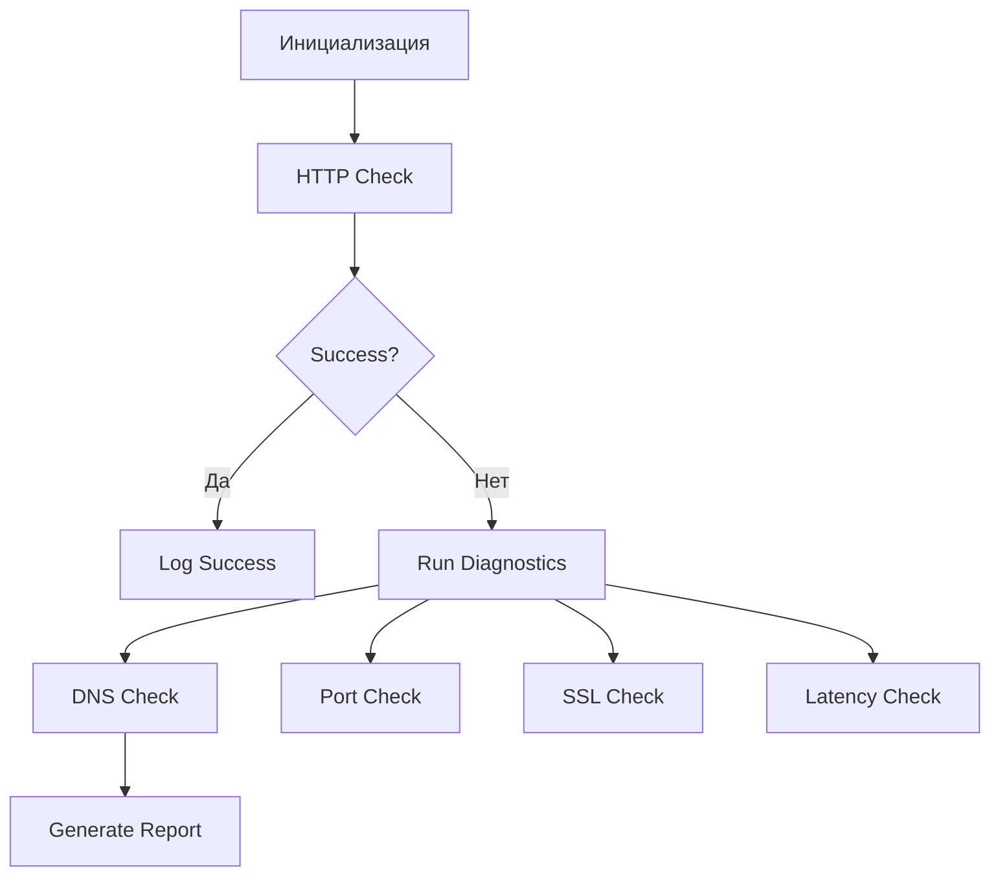

# Service Health and Diagnostic Monitor

## Overview
Скрипт для мониторинга доступности сервиса и автоматической диагностики проблем. Проверяет:
- HTTP статус 200
- Наличие ключевого слова "Success" в ответе
- При успешном сценарии - статус 200 и ключевое слово "Success" логи пишутся в stdout
- DNS резолвинг при ошибках
- Дополнительные метрики сети
- Диагностика запускается если:
    - Статус не равен 200 или ответ не содержит слово "Success"

## Features
- Проверка здоровья сервиса с таймаутом
- Комплексная диагностика при сбоях
- Логирование:
    - содержит формат timestamp и идентификатор действия
    - при диагностики логи пишутся в /tmp/diagnostic.log
- Расширенные сетевые проверки
- Конфигурируемые параметры

## Diagnostic Actions
1. **DNS Resolution** - помогает выявить проблемы с DNS-записями или доступностью DNS-серверов
2. **Port Check** - проверка доступности порта (по умолчанию 443)
3. **SSL Verification** - выявляет проблемы с сертификатами (истекшие, недоверенные)
4. **Latency Measurement** - замер времени отклика
5. **HTTP Headers Check** - анализ важных заголовков

## Requirements
- Python 3.8+
- Библиотеки: `requests`, `dnspython`

## Installation
```
git clone https://github.com/your-repo/service-health-monitor.git
cd service-health-monitor
pip install -r requirements.txt
```

## Usage
Базовый запуск:
```
python health_check.py \
  --url https://sre-test-assignment.innervate.tech/health.html \
  --keyword "Success"
```

Расширенные параметры:
```
python health_check.py 
  --url  
  --keyword "Success" 
  --timeout 5 
  --log-level DEBUG
```


## Configuration
Параметры можно задать через:
- Аргументы командной строки
- Файл `.env`
- Переменные окружения

Доступные параметры:
| Параметр      | По умолчанию               | Описание                  |
|---------------|---------------------------|---------------------------|
| --interval    | 60                        | Интервал проверок (сек)   |
| --timeout     | 10                        | Таймаут запроса (сек)     |
| --log-file    | diagnostics.log           | Файл логов               |
| --retries     | 3                         | Число попыток            |

## Sample Outputs
Успешная проверка:
[2023-11-20 15:30:45] SUCCESS - HTTP 200 | Keyword found | Latency: 128ms

Пример диагностики:
```
[2023-11-20 15:32:10] ERROR - Service check failed: Keyword mismatch
[2023-11-20 15:32:10] DNS Lookup: 
;; SERVER: 8.8.8.8#53(8.8.8.8)
;; WHEN: Mon Nov 20 15:32:10 CET 2023
;; MSG SIZE  rcvd: 92


[2023-11-20 15:32:12] SSL Cert Valid: True (Expires: 2024-01-01)
[2023-11-20 15:32:13] Average Latency: 450ms (Last 5 checks)
```

## Architecture



## Advanced Features
- Экспорт метрик в формате Prometheus
- Контекстные таймауты для разных проверок
- Цветовой вывод в консоль
- Поддержка прокси-серверов
- Исторический анализ показателей

## 🚀 Roadmap

### Q4 2025 - Q1 2026
| Статус       | Задача                          | Приоритет |
|--------------|---------------------------------|-----------|
| ✅ Завершено | Базовый функционал мониторинга  | High      |
| ⏳ В работе  | Контейнеризация проекта         | Critical  |

### Планируемые улучшения

#### 🐳 Инфраструктура
- [ ] Docker-образ с многоэтапной сборкой
- [ ] Helm-чарт для Kubernetes-деплоя
- [ ] Поддержка запуска как systemd-сервиса

#### 📊 Телеметрия
- [ ] Экспорт метрик в Prometheus Format
- [ ] Интеграция OpenTelemetry SDK
- [ ] Трейсинг распределенных транзакций

#### 🔔 Уведомления
- [ ] Slack-webhook интеграция
- [ ] Поддержка PagerDuty/MS Teams
- [ ] Эскалация алертов по расписанию

#### 🛠️ Оптимизации
- [ ] Асинхронная модель выполнения
- [ ] Конфигурируемые политики алертинга
- [ ] Графический дашборд для визуализации (Grafana)

#### 🎯 Функциональные улучшения
- [ ] Параллельные проверки ресурсов
- [ ] YAML-конфиги для списков сервисов

## Contribution
1. Форкните репозиторий
2. Создайте ветку для фичи (`feature/your-feature`)
3. Добавьте тесты
4. Отправьте Pull Request

## License
MIT License. Подробнее см. в файле LICENSE.