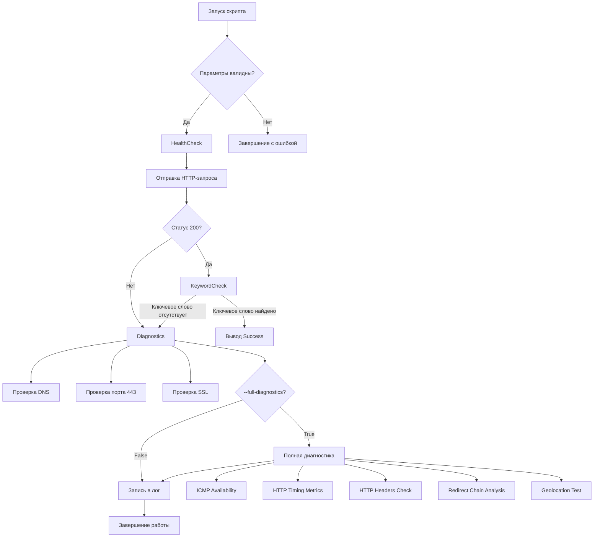

# Service Health and Diagnostic Monitor

## Overview
Командный инструмент для проверки доступности веб-сервисов с автоматической диагностикой проблем.

**Основная функциональность:**
- Проверка HTTP статуса 200
- Поиск ключевого слова "Success" в теле ответа
- Автоматический запуск диагностики при ошибках
- Детальное логирование всех операций

## Key Features

✅ Проверка здоровья сервиса с настраиваемым таймаутом  
✅ Комплексная диагностика сетевых проблем  
✅ Централизованное логирование в стандартизированном формате  
✅ Поддержка обязательных параметров CLI  
✅ Многоуровневая диагностика (базовая/расширенная)  
✅ Анализ полного цикла HTTP-запроса с таймингами  
✅ Межрегиональные проверки доступности сервиса

## Diagnostic Requirements
### Условия запуска диагностики:
1. Запуск диагностики если статус не равен 200 или тело не имеет слова "Success"
2. Расширенные проверки активируются флагом `--full-diagnostics true`

### Диагностические проверки:
**Базовые (всегда выполняются):**
1. **DNS Resolution (nslookup)**  
   Проверка корректности DNS-записей
2. **Port Check (443/TCP)**  
   Валидация доступности HTTPS-порта
3. **SSL Certificate Verification**  
   Проверка срока действия и валидности сертификата
4. **Latency Measurement**  
   Замер времени отклика сервиса

**Расширенные (требуют --full-diagnostics):**
5. **ICMP Availability**  
   Проверка доступности узла через ping
6. **HTTP Timing Metrics**  
   Анализ времени DNS, подключения, TTFB и передачи данных
7. **HTTP Headers Validation**  
   Проверка security headers и заголовков кеширования
8. **Redirect Chain Analysis**  
   Контроль цепочки редиректов (макс. 3 перенаправления)

## Diagnostic Actions Explanation
| Проверка                | Цель                                                                 | Режим       |
|-------------------------|----------------------------------------------------------------------|-------------|
| DNS Resolution          | Выявление проблем с DNS-серверами или некорректных записей           | Базовый     |
| Port Check              | Проверка доступности критических портов сервиса                      | Базовый     |
| SSL Verification        | Обнаружение проблем с SSL-сертификатами                              | Базовый     |
| Keyword Check           | Подтверждение корректности содержимого страницы                      | Базовый     |
| ICMP Availability       | Проверка сетевой доступности узла на уровне L3                       | Расширенный |
| HTTP Timing Metrics     | Локализация задержек на конкретных этапах запроса                    | Расширенный |
| HTTP Headers Check      | Валидация security headers (HSTS, CSP)                               | Расширенный |
| Redirect Chain Analysis | Предотвращение false-positive из-за цепочек редиректов               | Расширенный |


## Installation
```
git clone https://github.com/your-repo/service-monitor.git
cd service-monitor
python -m venv venv
source venv/bin/activate
pip install -r requirements.txt
```

## Usage
Базовый запуск:
```
python health_check.py \
  --url https://sre-test-assignment.innervate.tech/health.html \
  --keyword "Success"
```

Доступные параметры:
| Параметр      | По умолчанию              | Описание                  |
|---------------|---------------------------|---------------------------|
| --interval    | 60                        | Интервал проверок (сек)   |
| --timeout     | 10                        | Таймаут запроса (сек)     |
| --log-file    | diagnostics.log           | Файл логов                |
| --retries     | 3                         | Число попыток             |
| --keyword     | Success                   | Поиск слова ответе        |
| --full-diagnostics | false                | Расширенная диагностика   |


## Testing Scenarios
### Успешная проверка
```
python health_check.py --url https://valid-url/health.html --keyword "Success"
```

**Ожидаемый результат:**
Вывод "Success" в stdout
```
[2023-11-21 09:15:25] [INFO] [HTTP_CHECK] - Status code is 200 and response body contains a keyword "Success"
```

### Неудачная проверка
```
python health_check.py --url https://invalid-url/health.html --keyword "Success"
```

**Ожидаемый результат:**
- Пустой stdout
- Запись диагностических данных в diagnostics.log

### Расширенная диагностика
```
python health_check.py --url https://problem-url/health.html --full-diagnostics true
```
**Ожидаемый результат:**
- Все базовые и расширенные проверки в логе
- Детализированные метрики производительности:
```
[2023-11-21 14:30:45] [INFO] [HTTP_TIMING] - DNS: 152ms, Connect: 320ms, TTFB: 410ms
[2023-11-21 14:30:47] [WARNING] [REDIRECTS] - 4 redirects detected (max allowed: 3)
```

## Logging Format
**Требования к формату:**
[YYYY-MM-DD HH:MM:SS] [LEVEL] [ACTION] - Message

При запуске рассширенной диагностики выйдет сообщение:
[YYYY-MM-DD HH:MM:SS] [INFO] [CONFIG] - Full diagnostics mode enabled

**Пример логов:**
```
[2023-11-21 09:15:23] [ERROR] [HTTP_CHECK] - Status code 503 received
[2023-11-21 09:15:25] [INFO] [DNS_CHECK] - nslookup result for example.com: 192.0.2.1
[2023-11-21 09:15:27] [WARNING] [SSL_CHECK] - Certificate expires in 7 days
```

Полный пример логов: [Pastebin](https://pastebin.com/example123)

## Architecture


```mermaid
graph TD;
    Start[Запуск скрипта] --> ParamCheck{Параметры валидны?};
    ParamCheck -->|Да| HealthCheck;
    ParamCheck -->|Нет| Error[Завершение с ошибкой];
    HealthCheck --> HTTPReq[Отправка HTTP-запроса];
    HTTPReq --> StatusCheck{Статус 200?};
    StatusCheck -->|Да| KeywordCheck;
    StatusCheck -->|Нет| Diagnostics;
    KeywordCheck -->|Ключевое слово найдено| SuccessOutput[Вывод Success];
    KeywordCheck -->|Ключевое слово отсутствует| Diagnostics;
    
    Diagnostics --> DNS[Проверка DNS];
    Diagnostics --> Port[Проверка порта 443];
    Diagnostics --> SSL[Проверка SSL];
    Diagnostics --> CheckFullDiag{--full-diagnostics?};
    
    CheckFullDiag -->|True| FullDiagnostics[Полная диагностика];
    CheckFullDiag -->|False| Log[Запись в лог];
    
    FullDiagnostics --> Ping[ICMP Availability];
    FullDiagnostics --> HTTPTiming[HTTP Timing Metrics];
    FullDiagnostics --> Headers[HTTP Headers Check];
    FullDiagnostics --> Redirects[Redirect Chain Analysis];
    FullDiagnostics --> Geolocation[Geolocation Test];
    FullDiagnostics --> Log;
    
    Log --> Exit[Завершение работы];
```

## Advanced Features
- Экспорт метрик в формате Prometheus
- Контекстные таймауты для разных проверок
- Цветовой вывод в консоль
- Поддержка прокси-серверов
- Исторический анализ показателей

## 🚀 Roadmap

### Q4 2025 - Q1 2026
| Статус       | Задача                          | Приоритет |
|--------------|---------------------------------|-----------|
| ✅ Завершено | Базовый функционал мониторинга  | High      |
| ⏳ В работе  | Контейнеризация проекта         | Critical  |

### Планируемые улучшения

#### 🐳 Инфраструктура
- [ ] Docker-образ с многоэтапной сборкой
- [ ] Helm-чарт для Kubernetes-деплоя
- [ ] Поддержка запуска как systemd-сервиса

#### 📊 Телеметрия
- [ ] Экспорт метрик в Prometheus Format
- [ ] Интеграция OpenTelemetry SDK
- [ ] Трейсинг распределенных транзакций

#### 🔔 Уведомления
- [ ] Slack-webhook интеграция
- [ ] Поддержка PagerDuty/MS Teams
- [ ] Эскалация алертов по расписанию

#### 🛠️ Оптимизации
- [ ] Асинхронная модель выполнения
- [ ] Конфигурируемые политики алертинга
- [ ] Графический дашборд для визуализации (Grafana)

#### 🎯 Функциональные улучшения
- [ ] Параллельные проверки ресурсов
- [ ] YAML-конфиги для списков сервисов

## Contribution
1. Форкните репозиторий
2. Создайте ветку для фичи (`feature/your-feature`)
3. Добавьте тесты
4. Отправьте Pull Request

## License
MIT License. Подробнее см. в файле LICENSE.